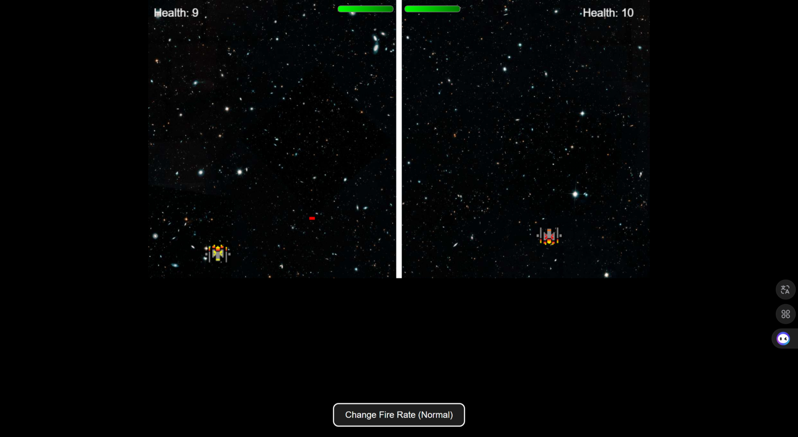

---

# 🚀 Spaceship Game

Bienvenue dans le projet **Spaceship Game**, un jeu multijoueur dynamique et personnalisable développé avec **Python** et **Pygame**, maintenant aussi disponible en ligne en version **HTML/JavaScript** pour une expérience accessible depuis n’importe quel navigateur 🌐.

---

## 🔗 Démo en ligne

🌐 Joue directement : [https://j0yb0y28.github.io/Spaceship_Game/](https://j0yb0y28.github.io/Spaceship_Game/)

---

## 📁 Structure du projet

```
Spaceship_Game/
├── Assets/                   # Contient les images du jeu
│   ├── Red_Spaceship.png     # Vaisseau rouge
│   ├── Yellow_Spaceship.png  # Vaisseau jaune
│   └── space.jpg             # Fond spatial
├── main.py                   # Script principal Pygame
├── utility.py                # Fonctions utilitaires (mouvements, chargement)
├── requirements.txt          # Dépendances Python (pygame)
├── index.html                # Version HTML jouable dans le navigateur
├── README.md                 # Présentation du projet
└── .gitignore
```

---

## ✨ Fonctionnalités

- 🎮 Mode **Multijoueur local (PvP)** ou **Solo vs IA**
- 🧠 **IA adaptative** avec niveaux de difficulté (`Easy`, `Medium`, `Hard`)
- 🛡️ IA capable de **défendre ou attaquer intelligemment** en fonction de sa santé
- ⏳ **Compte à rebours** stylisé avant chaque partie
- ⚙️ **Paramètres personnalisables** : mode de jeu, difficulté, vitesse
- 💻 Interface **web responsive** avec design élégant
- 🔄 **Contrôle clavier personnalisable** (WASD ou flèches)

---

## 🕹️ Commandes

### Joueur 1 (gauche) – par défaut :
- **Déplacement** : `W` `A` `S` `D`
- **Tir** : `F`

### Joueur 2 (droite) :
- **Déplacement** : Flèches directionnelles
- **Tir** : `Ctrl Droit`

### Pause :
- ** Mettre le jeu en pause** : `P`
---

## 🚀 Lancement en local (version Python)

### 1. Cloner le projet

```bash
git clone https://github.com/J0YB0Y28/Spaceship_Game.git
cd Spaceship_Game
```

### 2. Installer les dépendances

```bash
pip install -r requirements.txt
```

### 3. Lancer le jeu

```bash
python main.py
```

---

## 🧠 Technologies utilisées

- 🎮 `Pygame` pour la version locale Python
- 🕸️ `HTML`, `CSS`, `JavaScript` pour la version web
- 🚀 Déploiement GitHub Pages pour la démo en ligne

---

## 🧑‍💻 Auteur

Projet développé par **Teddy Kana**  
📧 [kanaboumkwoiit@outlook.com](mailto:kanaboumkwoiit@outlook.com)  
🔗 [Portfolio](https://j0yb0y28.github.io/portfolio/) · [GitHub](https://github.com/J0YB0Y28) · [LinkedIn](https://www.linkedin.com/in/teddy-kana-6a26832b9/)

---

## 🧩 Améliorations futures

- [ ] 🎧 Ajout de **sons de tir/explosion**
- [ ] 🧠 IA encore plus réaliste (anticipation des mouvements ennemis)
- [ ] 📱 Adaptation mobile avec commandes tactiles
- [ ] 📊 Mode survie avec score/chrono

---

## 🖼️ Capture d’écran (à ajouter si souhaité)



---

## ✅ Licence

Ce projet est open-source sous licence MIT.

---
